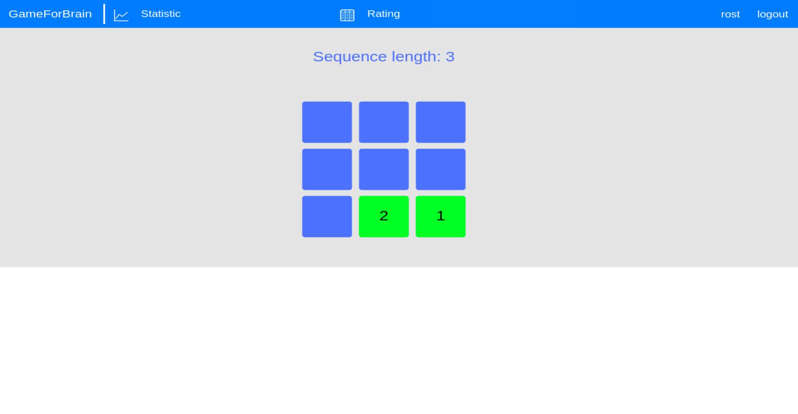

# Зміст

1. [Вступ](#introduction)
2. [Технічне завдання](#techtask)
3. [Проектування](#design)
4. [Розробка](#development)
5. [Тестування](#test)
6. [Висновки](#conclusion)

##  1. Вступ 
### 1.1 Ціль проєкт

GamesForBrain - веб ресурс, метою якого є розміщення міні-ігор тренажерів що 
розвивають увагу, пам'ять, мислення та покращують мозгову активність.

### 1.2 Реалізація

Backend частина проєкту виконана на java Spring, frontend частина з використанням
javascript бібліотек.

## 2. Технічне завдання 

### 2.1 Загальне завдання

Розробити вебсайт, на якому користувач може створити обліковий запис, та має 
можливість грати в ігри що розвивають його когнітивні здібності.

### 2.2 Функціональність

 - користувач повинен мати можливість створити обліковий запис, в якому буде зберігатись
 його прогрес.
 - користувач повинен мати можливість переглядати статистику своїх ігор.
 - користувач повинен мати можливість порівнювати свої результати з результатами інших 
 користувачів.

## 3. Проектування  

### 3.1 Прецеденти

// Юз кейси з діаграмами варіантів користування нашим ресурсом

### 3.2 Проєктування графічного інтерфейсу користувача

// Скріншоти сторінок нашого ресурсу, з описами віджетів, та їх функціональністю

### Головна сторінка

На головній сторінці користувач має можливість перейти на сторінку Statistic, Rating, 
зайти в панель адміна або вийти з акаунту натиснувши на відповідні іконки в верхній панелі а також 
перейти на сторінку одного з 5 тестів.

### Сторінка тесту

Під час тесту
 
По закінченню тесту

На цій сторінці користувач має можливість протестувати свої когнітивні здібності
проходячи один з тестів, по закінченю гри користувачу виводиться графік з частотою результатів всіх
користувачів цієї гри, а також інформація наскільки його останній результат кращий ніж у інших.

### Сторінка статистики

На цій сторінці користувач має можливість переглянути графіки зі своїми результатами у тестах

### Сторінка рейтингу

На цій сторінці користувач має можливість подивитись свої
результати у відповідному тесті в також інших користувачів у відсортованій таблиці
та порівняти з ними.

### Сторінка адміна

На цій сторінці користувач з правами адміна має можливість 
переглянути параметри тестів а також змінювати їх.
Кнопка delete прибирає тест з головної сторінки;
Кнопка update дає можливість змінити такі параметри тесту як:
ім'я тесту, статус тесту, тип тесту

## 4. Розробка  
 
 // В цьому блоці знаходяться юмл діаграми класів та юмл діаграми бд
 з детальним описом
 
## 5. Тестування   

// в цьому блоці опис того як ми тестуємо на додаток

## 6. Висновки   

// висновки
